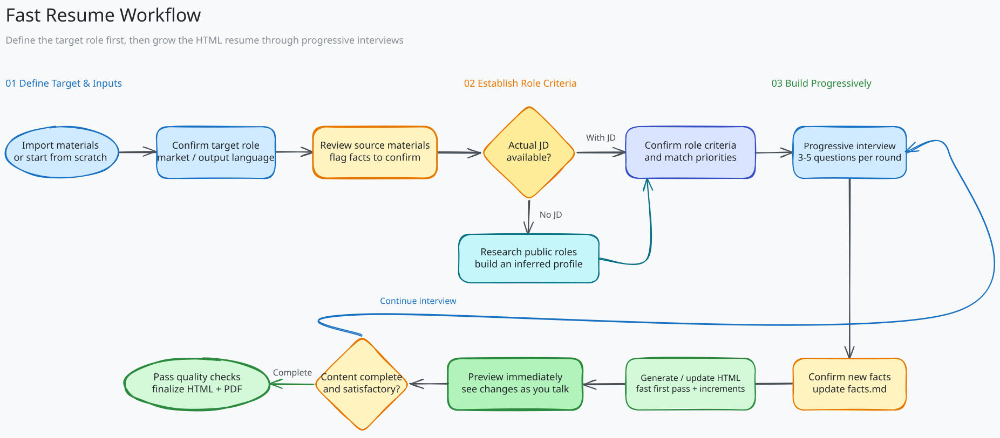

<div align="center">
  
  <p><strong>Turn real experience into a resume built for the role.</strong></p>
  <p>
    <strong>English</strong> |
    <a href="./README_ZH.md">简体中文</a>
  </p>
  <p>
    
    
    
  </p>
  <p>
    <a href="#why-fast-resume"></a>
    <a href="#quick-start"></a>
  </p>
</div>

Fast Resume is an open-source resume Agent Plugin for **GitHub Copilot**. Instead of skipping fact-checking and polishing a resume into something merely convincing, it builds a traceable career evidence base through progressive interviews, then handles resume assessment, role matching, content tailoring, HTML preview, and PDF delivery.

## Why Fast Resume?

Many AI resume tools begin with “How can this sound better?” Fast Resume starts with a more important question: **Is this statement true, and where is the evidence?**

- **Evidence before prose**: Every key statement comes from a local `facts.md`; it never invents experience, responsibilities, skills, or results.
- **A career consultant that follows up**: It interviews you in rounds about context, responsibilities, individual actions, and outcomes, while showing how much remains.
- **Lower activation energy**: If a blank page feels impossible, wording decisions keep stalling you, or ADHD and other executive-function challenges make starting difficult, the Agent advances one topic at a time with 3–5 questions instead of handing you a long form.
- **No false matches**: Role matching uses “covered / insufficient evidence / not covered” rather than turning keyword overlap into an inflated score.
- **Reorganized for the role, not rewritten line by line**: The target market and role determine the detail, order, and wording of your experience.
- **See results as you talk**: As soon as enough information exists, Fast Resume creates an HTML draft and updates it incrementally instead of waiting for the entire interview to end.
- **Verifiable delivery**: Before finalizing, it checks evidence traceability, placeholders, baseline ATS compatibility, and print layout, then generates a PDF with selectable text.
- **Clear privacy boundaries**: No account, custom backend, or plugin telemetry is required; persistent files stay in the working directory you choose.

<p align="center">
  
</p>

Fast Resume uses two complementary frameworks:

- **STAR** gathers and checks evidence without mechanically turning every resume entry into a four-part template.
- **Tailor-Match-Quantify** selects role-relevant content, matches only genuine capabilities, and distinguishes exact, estimated, and derived values honestly.

## What Can It Do?

| Scenario | How Fast Resume handles it |
| --- | --- |
| Create a resume from scratch | Choose quick, standard, or deep mode and build it progressively through interviews |
| Import an existing resume | Extract original claims, flag facts that need confirmation, and resolve conflicts between sources |
| Assess a resume | Check factual risk, evidence completeness, writing, structure, and baseline ATS compatibility |
| Match a real JD | Evaluate separately whether evidence exists and whether the resume presents it |
| Work without a JD | Research public roles, create a sourced inferred role profile, and use it only after confirmation |
| Tailor role-specific versions | Share one evidence base while selecting and writing independently for each role and language |
| Export deliverables | Generate a single-file HTML resume, then create versioned PDFs after quality checks pass |

## Quick Start

### Prerequisites

- VS Code with GitHub Copilot Chat, or GitHub Copilot CLI
- A Copilot model with tool calling and sufficient context capacity
- A trusted private working directory for personal resume data

### Install the Plugin

```bash
copilot plugin marketplace add lanbaoshen/fast-resume
copilot plugin install fast-resume@fast-resume
```

The first command adds the Fast Resume plugin marketplace. The second installs Fast Resume from that marketplace. Before each use, select **Resume Consultant** from Copilot's Agent picker.

Then enter a simple prompt, for example:

- `Help me write a resume.`
- `Build a role profile for an AI Engineer.`
- `Assess how well my resume matches the JD.`
- `Assess my resume.`

The Agent first explains the goal, stages, deliverables, and decisions for the session, then begins analyzing your materials or asks the first set of questions in the same turn.

## Outputs

All personal data is written to the current working directory, never to the plugin installation directory:

```text
resume/
├── facts.md                         # Single source of truth for career facts
├── assessments/                    # Resume assessments and role-match reports
├── research/                       # Role research when no JD is available
└── resumes/
    └── <target-role>-<language>/
        ├── resume.html              # Continuously updated working version
        ├── resume-v1.html           # Immutable finalized version
        └── resume-v1.pdf
```

Versions for different roles and languages share the same evidence base, but their content is selected and written independently rather than translated line by line.

## Privacy & Security

- Fast Resume provides no account system, custom server, or plugin telemetry.
- Resume files stay in the local working directory you approve and are never written to the plugin directory.
- GitHub Copilot still processes the prompts and context needed to complete tasks according to its service terms.
- Never commit a `resume/` directory containing real personal information to a public repository. On first use, the Agent offers a `.gitignore` safeguard.
- Government identification numbers never enter the evidence base. Age, gender, marital status, full address, and photos are not collected by default.

## Contributing

Fast Resume welcomes contributors interested in improving career evidence modeling, resume assessment, cross-market writing, HTML/PDF delivery, and mock interview experiences.

- Before opening an Issue, describe the use case, target market, and reproducible steps, and remove all personal or company-sensitive information.
- Pull Requests should preserve clear responsibility boundaries and preferably include corresponding anonymous test scenarios.
- For new features or changes to product boundaries, open an Issue first to explain the motivation, user scenario, and expected behavior.

## License

Fast Resume is open source under the [MIT License](LICENSE).

---

<div align="center">
  <strong>A resume can be improved. Facts cannot be rewritten.</strong>
  <br><br>
  If this approach is useful, please Star the project, try it, and share real feedback.
</div>
