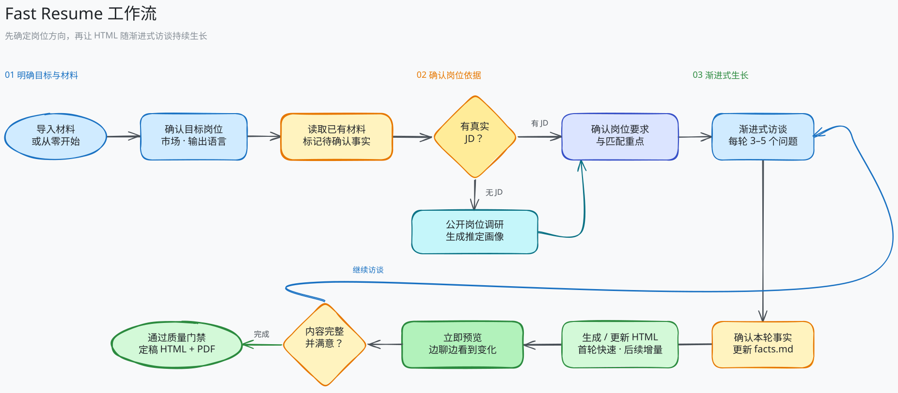

<div align="center">
  
  <p><strong>让真实经历，长成一份真正匹配岗位的简历。</strong></p>
  <p>
    <a href="./README.md">English</a> |
    <strong>简体中文</strong>
  </p>
  <p>
    
    
    
  </p>
  <p>
    <a href="#为什么是-fast-resume"></a>
    <a href="#快速开始"></a>
  </p>
</div>

Fast Resume 是一个面向 **GitHub Copilot** 的开源简历 Agent Plugin。它不会跳过事实核验直接“润色”出一份看似完美的简历，而是通过渐进式访谈建立可追溯的职业事实库，再完成简历评估、岗位匹配、内容定制、HTML 预览和 PDF 交付。

## 为什么是 Fast Resume？

很多 AI 简历工具从“怎么写得更好”开始。Fast Resume 先回答另一件更重要的事：**这句话是否真实，证据在哪里？**

- **事实先于文案**：所有关键陈述都来自本地 `facts.md`，不虚构经历、职责、技能或成果。
- **会追问的职业顾问**：围绕背景、责任、个人行动和结果分轮访谈，并告诉你距离完成还有多远。
- **降低启动阻力**：如果你面对空白页无从下手、总在措辞间反复纠结，或因 ADHD 等注意力与执行功能挑战难以开始，Agent 会一次只推进一个主题，用 3–5 个问题带你持续完成，而不是丢给你一张漫长的表格。
- **拒绝伪匹配**：岗位匹配使用“已覆盖 / 证据不足 / 尚未覆盖”，不用关键词重合制造虚假的高分。
- **为岗位重新组织，而非逐句改写**：根据目标市场和岗位决定经历的详略、顺序与措辞。
- **边聊边看到结果**：信息足够时立即生成 HTML 草稿，后续增量更新，不必等访谈全部结束。
- **可验证的最终交付**：定稿前检查事实追溯、占位符、ATS 基础兼容性和打印排版，再生成可复制文本的 PDF。
- **隐私边界清楚**：无需账户、自建后端或插件遥测；持久化文件只保存在用户选择的工作目录中。

<p align="center">
  
</p>

Fast Resume 内部使用两组原则：

- **STAR** 用于采集和检查证据，但不会把简历机械地写成四段模板。
- **Tailor-Match-Quantify** 用于针对岗位取舍内容、匹配真实能力，并诚实表达精确值、估算值或推导值。

## 可以用它做什么？

| 场景 | Fast Resume 的处理方式 |
| --- | --- |
| 从零创建简历 | 选择快速、标准或深入模式，通过访谈逐步生成 |
| 导入已有简历 | 提取原始陈述，标记待确认事实并处理材料冲突 |
| 简历体检 | 检查真实性风险、证据完整性、表达、结构和 ATS 基础兼容性 |
| 匹配真实 JD | 分开判断“你是否有证据”和“简历是否呈现了证据” |
| 没有 JD | 调研公开职位并生成带来源的推定岗位画像，确认后再使用 |
| 定制岗位版本 | 共享同一事实库，为不同岗位和语言独立选材与改写 |
| 导出结果 | 生成单文件 HTML，并在质量门禁通过后输出版本化 PDF |

## 快速开始

### 前置条件

- VS Code + GitHub Copilot Chat，或 GitHub Copilot CLI
- 支持工具调用且具备足够上下文能力的 Copilot 模型
- 一个可信的私有工作目录，用于保存个人简历数据

### 安装插件

```bash
copilot plugin marketplace add lanbaoshen/fast-resume
copilot plugin install fast-resume@fast-resume
```

第一条命令添加 Fast Resume 插件市场，第二条命令从该市场安装插件。安装完成后，使用前请先在 Copilot 的 Agent 选择器中选择 **Resume Consultant**。

然后直接输入一句话，例如：

- `帮我写简历。`
- `构建 AI Engineer 的岗位画像。`
- `评估简历和 JD 的匹配度。`
- `评估我的简历。`

Agent 会先说明本次工作的目标、阶段、交付物和需要你决定的节点，然后在同一轮开始分析材料或提出第一组问题。

## 产物

所有个人数据都写入当前工作目录，而不是插件安装目录：

```text
resume/
├── facts.md                         # 唯一职业事实来源
├── assessments/                    # 简历体检与岗位匹配报告
├── research/                       # 无 JD 时的岗位调研记录
└── resumes/
    └── <target-role>-<language>/
        ├── resume.html              # 持续迭代的工作版本
        ├── resume-v1.html           # 不可覆盖的定稿版本
        └── resume-v1.pdf
```

不同岗位和语言版本共享事实库，但会独立组织和撰写，不做逐句翻译。

## 隐私与安全

- Fast Resume 不提供账户、自建服务器或插件遥测。
- 简历文件保存在你确认的本地工作目录中，不会写入插件目录。
- GitHub Copilot 仍会按照其服务方式处理完成任务所需的提示和上下文。
- 不要把包含真实个人信息的 `resume/` 目录提交到公开仓库；首次使用时，Agent 会主动提供 `.gitignore` 防误提交选项。
- 身份证件号码永远不会进入事实库；年龄、性别、婚姻状况、完整住址和照片默认不采集。

## 参与贡献

Fast Resume 正在寻找愿意一起打磨职业证据建模、简历评估、跨市场写作、HTML/PDF 交付和模拟面试体验的贡献者。

- 提交 Issue 前，请说明使用场景、目标市场和可复现步骤，并移除所有个人或公司敏感信息。
- Pull Request 应保持职责边界清晰，并优先补充对应的匿名测试场景。
- 涉及新功能或产品边界调整时，请先通过 Issue 说明动机、用户场景和预期行为。

## License

Fast Resume 基于 [MIT License](LICENSE) 开源。

---

<div align="center">
  <strong>简历可以被优化，事实不能被改写。</strong>
  <br><br>
  如果这个方向对你有帮助，欢迎 Star、试用并分享真实反馈。
</div>
